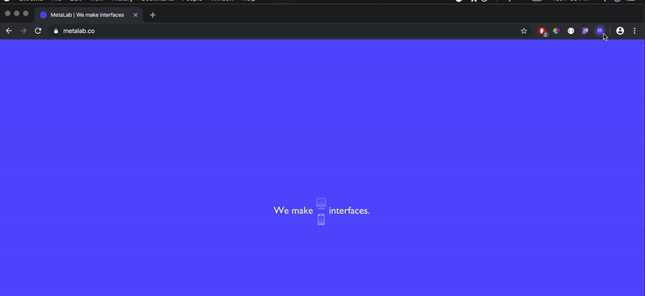

# MetaLab Metadata

Have you ever really liked someone’s wardrobe, and wanted to know where they got certain items, and how they put them together? This Chrome extension comes from a similar impulse: liking an interface design firm’s products, and wanting to get a little notification when I’m on a product they’ve been involved with. It’s a simple approach where the extension button is only active when the tab matches a list of URIs, and when it’s active it can be clicked and a small popup appears.

## Demo

## To Use

This is not published on the Chrome Web Store, but you can use the extension by pulling the files in the repo and then loading the extension into Chrome in developer mode. See more details [here](https://developer.chrome.com/extensions/getstarted#manifest).

## Next Steps

#### Improve the UI

There are a few parts of this simple UI that could use a better implementation:
- I had to fight a lot with CSS bleeding into my popup div from the rest of the page, so ideally I would like to protect against this a bit more carefully (maybe put the popup in an iframe)
- the `x` button currently triggers a page refresh (since that was a simple way to clear the popup) but ideally we would just remove the popup from the DOM while being careful not to disrupt the page

#### Improve the Matching

At the moment, the extension matches based on an array of strings I cobbled together with online research. Ideally, we would make two improvements:
- the data detailing which pages are Metalab projects would live in a database, and be made accessible through an API (so that the Chrome extension could make requests when a new URI is visited or an active tab changed)
- the online research to determine MetaLab project pages could be made more automatic by inspecting the DOM of any particular page for clues, or by scraping MetaLab's [dribbble page](https://dribbble.com/metalab) to see when they post new work
